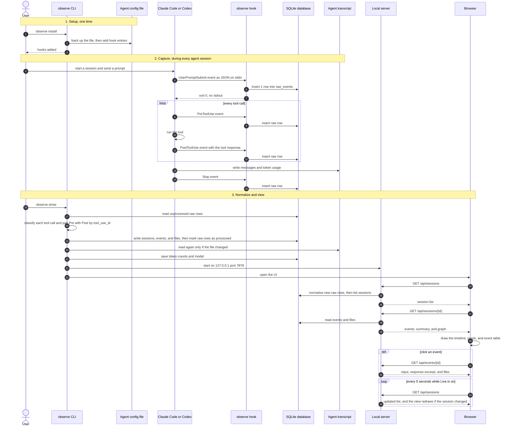

# End-to-end call flow

This diagram shows 1 full cycle: you install the hooks, the agent works, and then you open the
UI. For the parts and the reasons behind them, see [architecture.md](architecture.md).

## What each step means

- **Steps 1 to 3.** `observe install` adds 1 hook entry for each event to the agent config
  file. The command in each entry is `python -m observe <agent> hook`.
- **Steps 4 to 15.** The agent calls the hook for each event. The hook only saves the raw JSON.
  It does not parse it, so the agent does not slow down.
- **Steps 16 to 23.** `observe show` turns the raw rows into sessions, events, and files. Token
  counts come from the agent transcript, because hook events do not contain them.
- **Steps 24 to 34.** The browser gets JSON from the local server. Each request to the session
  list first normalizes any new raw rows, so a running session shows new events.
